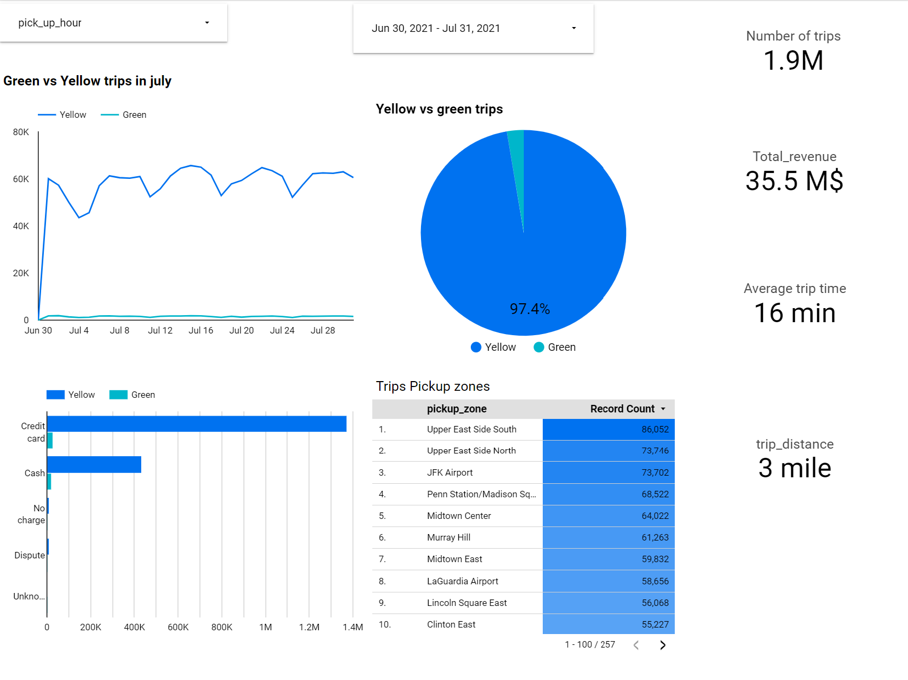
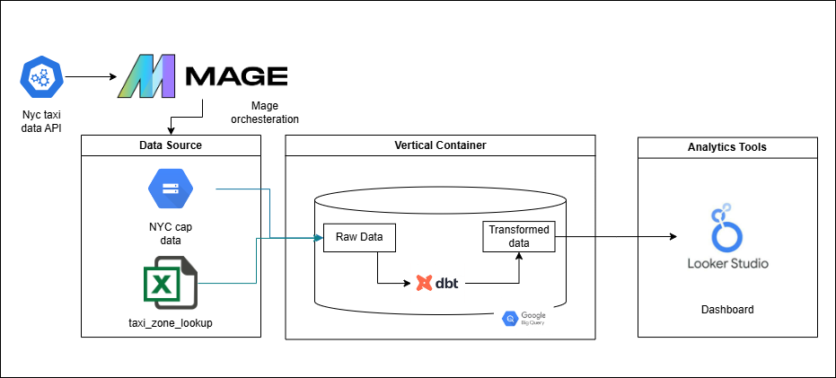

# NYC Taxis Analysis

[Introduction](#introduction)
[Data Source](#data-is-extracted-from-nyc-taxi-website)
[Problem description](#whats-case-about-problem-description)
[Technologies](#technology-stack)
[data Pipelines](#data-pipeline-flow)
[data modeling](#2-dbt-transformations)
[dashboard](#3-dashboarding)

## Introduction
This project simulates the data engineering process starting from data source facing transcations like Data ingestion and combining all into a single data base Using ETL and orchestration tools like Mage and dbt connecting with GCP api to connect to google storage and google big query finally connects to the google locker studio to make the final dashboard

## Data is extracted from nyc taxi website
 - https://www.nyc.gov/site/tlc/about/data.page

What does it contain?
The dataset is composed of a big parquet files that includes the taxi trips for a month of a year what we are working with is 2 parquet files which are month 7 2021 for yellow and green taxes.

`parquet` is a columnar based data storage

## What's case about? (Problem description)
- providing analytics and statistics on all the nyc taxi during the month 7 of 2021 including all the trips and the distance covered tottal time of travelling also discovering some facts about the profit and zones with most trips and compare between yellow and green taxi with the usage of each and size of trips.

## Technology Stack

- **Docker**
    - **Containerization**: running mage on docker using compose up command to run in container.

- **Google Cloud Platform** (GCP)
    - **Google Cloud Storage (Datalake)**: Where data lands from the bash script that we run on Google Cloud VM
    - **BigQuery (Datawarehouse)**: Where data is stored in dimensional modeling.

- **Mage**
    - **Orchestration Tool**: Used for our data pipeline flow.

- **DBT** (Data Build Tool)
    - **Reporting Layer**: Built in models.

- **Looker Data Studio** 
    - **Dashboard**: - [Google Looker Studio](https://lookerstudio.google.com/reporting/9568fb9a-0ea4-4b6f-b9da-d897b0f8abd4).
    

    U need to adjust the data to month 7 of year 2021 to make the charts percise.


## Data Pipeline Flow



As shown in image our data flow consists of below section:

**1. Data orchestration**:
- setting up mage instance:
    ```bash
    git clone https://github.com/mage-ai/mage-zoomcamp.git mage-zoomcamp
    ```
- Navigate to the repo:
    ```bash
    cd mage-data-engineering-zoomcamp
    ```
- Rename dev.env to simply .env— this will ensure the file is not committed to Git by accident, since it will contain credentials in the future.

- Now, let's build the container
    ```bash
    docker compose build
    ```
- Now, navigate to http://localhost:6789 in your browser! Voila! You're ready to get started with Mage.

- create our pipelines: (from GCS, transforming, to Biquery dataset )

    - Project contains 3 pipelines :

    1. load direct for api to big query data which holds over 51k million records for green data 
        

    2. Load from api to gcs for yellow

        
    
    3. Load from gcs to big query this better for data storage

        


**2. Datawarehouse schema**:

- managed to create the dwh schema of the facts and dims tables:
    
 


## 2. DBT transformations

In this step, we initiate our dbt project to create the required transformations and views. We are using Google BigQuery as our data warehouse.

### Prerequisites

- Make sure you have dbt installed. If not, you can install it using pip: `pip install dbt` or use the dbt cloud IDE.
- You need to have a Google Cloud Platform (GCP) account and access to a BigQuery dataset.

### Setup

1. **Create a dbt profile**: dbt uses profiles to manage connection settings to your data warehouse. Create a `profiles.yml` file in your dbt directory (usually `~/.dbt/`) and provide the necessary details. Here's an example for a BigQuery setup:

```yaml
your-profile:
  target: dev
  outputs:
    dev:
      type: bigquery
      method: service-account
      project: your-gcp-project
      dataset: your-dataset
      threads: 1
      timeout_seconds: 300
      location: US
      keyfile: /path/to/service-account.json
```
Replace `your-profile`, `your-gcp-project`, `your-dataset`, and `/path/to/service-account.json` with your actual profile name, GCP project ID, dataset, and service account key file path.

2. Initialize a dbt project: Navigate to the directory where you want to create your dbt project and run: `dbt init your-dbt-project`. Replace `your-dbt-project` with the name you want to give to your dbt project.

3. Build your dbt project: A dbt project consists of models (SQL files), tests, snapshots, macros, and more. You'll create these in the respective directories within your dbt project.

4. Run your dbt project: Once you've set up your models and other components, you can run your dbt project with: `dbt run`. This command compiles your dbt models to SQL and runs them against your BigQuery dataset.

Remember to navigate to your dbt project directory before running the `dbt run` command.


## 3. Dashboarding
- create a data source on looker studio using the resulting data from DBT model on Bigquery
- Check out the dashboards below:
- **Nyc Taxi july 2021 analysis** 
- https://lookerstudio.google.com/reporting/9568fb9a-0ea4-4b6f-b9da-d897b0f8abd4
- Dashboard showing the Performance stats of players such as Goals, Assists, Market Value and more.

- screenshot of the dashboard:
    
