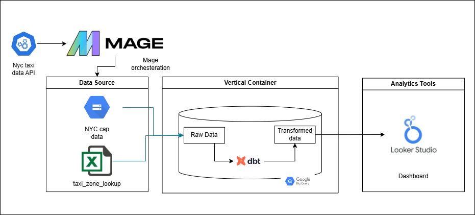

[About the project](#about-the-project)

## About the project
A project includes the following files: 
- dbt_project.yml: file used to configure the dbt project. If you are using dbt locally, make sure the profile here matches the one setup during installation in ~/.dbt/profiles.yml
- *.yml files under folders models, data, macros: documentation files
- csv files in the data folder: these will be our sources, files described above
- Files inside folder models: The sql files contain the scripts to run our models, this will cover staging, core and a datamarts models. At the end, these models will follow this structure: 

### Workflow

### Execution
After having installed the required tools and cloning this repo, execute the following commnads: 

1. Change into the project's directory from the command line: `$ cd [..]/taxi_rides_ny`
2. Load the CSVs into the database. This materializes the CSVs as tables in your target schema: `$ dbt seed`
3. Run the models: `$ dbt run`
4. Test your data: `$ dbt test`
_Alternative: use `$ dbt build` to execute with one command the 3 steps above together_
5. Generate documentation for the project: `$ dbt docs generate`
6. View the documentation for the project, this step should open the documentation page on a webserver, but it can also be accessed from  http://localhost:8080 : `$ dbt docs serve`

### dbt resources:
- Learn more about dbt [in the docs](https://docs.getdbt.com/docs/introduction)
- Check out [Discourse](https://discourse.getdbt.com/) for commonly asked questions and answers
- Join the [chat](http://slack.getdbt.com/) on Slack for live discussions and support
- Find [dbt events](https://events.getdbt.com) near you
- Check out [the blog](https://blog.getdbt.com/) for the latest news on dbt's development and best practices